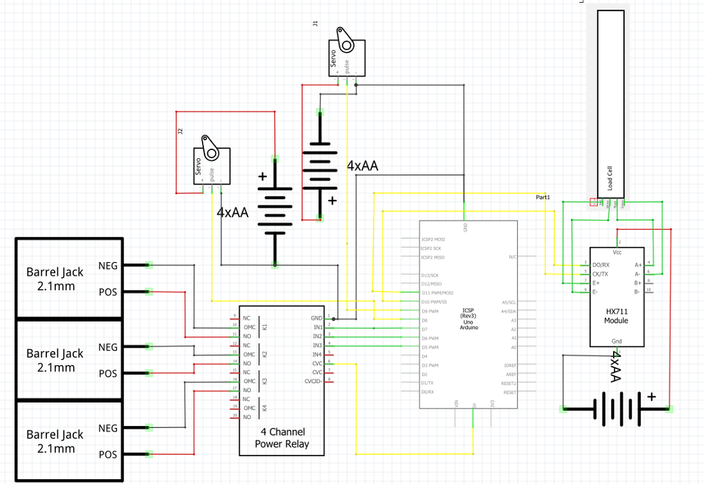

# BioFer

A device that converts biodegradable waste into horticultural substrates, which will help in speeding up the daily decrease of biodegradable waste.

## Materials Used
#### Main Components: 
- 2pcs Arduino Uno
- 2pcs servo motors
- 1pc Ultrasonic sensor
- 1pc 4-channel relay
- 1pc Weight sensor
- 30pcs Jumper wires
- 2pcs Breadboard
- 8pcs 1.5v batteries

#### Other Materials Used:
- 1pc Water dispenser case
- 4pcs wheels
- 1pc Pulverizer
- 1pc strainer
- 1pc trash bin
- 40pc screws and washers
- 1pc Epoxy resin
- 1pc blender blades
- 2pcs PVC pipes
- 6pcs PVC pipe elbows

## Schematic Diagram

 

This project is created in partial fullfilment of requirements in electronics and robotics.  
SCIENCE, TECHNOLOGY, AND ENGINEERING • CAMARINES SUR NATIONAL HIGH SCHOOL • **A/Y 2018-2019**
